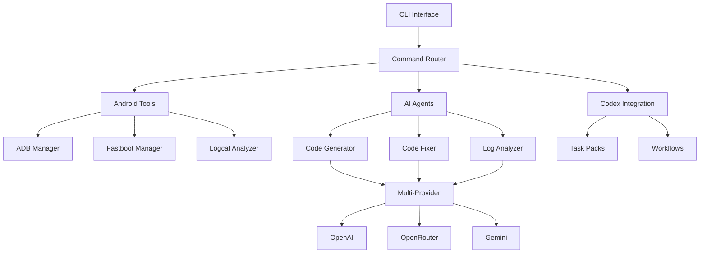

# 🤖 Codex-Android-AI-Agent (CADX)

> **Open source Android development automation with Codex CLI, multi-agent pipelines, and AI-powered workflows**

[](https://opensource.org/licenses/MIT)
[](https://www.python.org/downloads/)
[](https://developer.android.com/studio)

**CADX** is an innovative open-source toolkit that bridges Android development with modern AI capabilities. By combining Codex CLI integration, multi-agent AI pipelines, and comprehensive Android automation, CADX enables developers to streamline their workflow and focus on building great apps.

## ✨ Key Features

### 🔧 **Codex CLI Integration**
- Seamless integration with Anthropic's Codex CLI
- Automated code generation and fixing
- Suggest, auto-edit, and full-auto modes
- Quiet mode for CI/CD pipelines
- Custom codex.md instructions for Android projects

### 🤖 **Multi-Agent AI System**  
- **Code Generation Agent**: Context-aware Android code generation
- **Code Fixing Agent**: Intelligent bug fixes and code improvements
- **Log Analysis Agent**: Advanced crash and performance analysis
- **Multi-Provider Support**: OpenAI, OpenRouter, Google Gemini

### 📱 **Android Development Automation**
- **ADB Integration**: Device management and shell operations
- **Fastboot Support**: Flashing and recovery operations  
- **Logcat Analysis**: Real-time log monitoring and AI-powered insights
- **Device Management**: Multi-device support and capability detection

### 🚀 **CI/CD & Workflows**
- GitHub Actions integration
- Automated testing and validation
- Task packs for common workflows
- JSON output for programmatic use

## 🚀 Quick Start

### Installation

```bash
# Install CADX
pip install codex-android-ai-agent

# Or install from source
git clone https://github.com/username/codex-android-ai-agent
cd codex-android-ai-agent
pip install -e .

# Verify installation
cadx --version
```

### Configuration

```bash
# Configure AI providers
cadx config set-provider openai YOUR_OPENAI_KEY --model gpt-4
cadx config set-provider openrouter YOUR_OPENROUTER_KEY --model anthropic/claude-3.5-sonnet

# Check configuration
cadx config --show
```

### First Steps

```bash
# Check system status
cadx status

# List connected Android devices
cadx android devices

# Generate Android code
cadx agents generate-code "Create a RecyclerView adapter for user list" --lang kotlin

# Analyze logs with AI
cadx android logcat --analyze --duration 30

# Execute predefined workflows
cadx codex task-pack android-setup --project ./my-android-app
```

## 📖 Usage Examples

### 🎯 **Automated Code Generation**

```bash
# Generate MainActivity with specific features
cadx agents generate-code "Create MainActivity with ViewBinding, ViewModel, and RecyclerView" \
  --provider openai --output MainActivity.kt --lang kotlin

# Fix code issues automatically  
cadx agents fix-code MainActivity.kt --backup --provider claude

# Generate build.gradle with dependencies
cadx agents generate-code "Gradle script with Compose, Room, and Hilt dependencies" \
  --lang gradle --output app/build.gradle.kts
```

### 📊 **Log Analysis & Debugging**

```bash
# Real-time log analysis with AI insights
cadx android logcat --analyze --filter "MyApp" --provider gemini

# Analyze crash logs
cadx agents analyze-logs crash.log --provider openai

# Export structured log analysis
cadx android logcat --save logs.json --json --duration 60
```

### 🔄 **Workflow Automation**

```bash
# Setup new Android project
cadx codex task-pack android-setup --project ./NewApp

# Code quality improvements
cadx codex task-pack code-quality --project ./existing-app

# CI/CD pipeline setup
cadx codex task-pack ci-cd --project ./my-app

# Custom Codex integration
cadx codex init-project ./my-app --android --codex-md
```

### ⚙️ **Device Management**

```bash
# List devices with detailed info
cadx android devices --json

# Install APK with analysis
cadx android install app.apk --device emulator-5554 

# Device health monitoring
cadx android build-info --device phone-123

# Fastboot operations
cadx android fastboot flash boot boot.img --device phone-123
```

## 🏗️ Architecture



## 📦 Task Packs

CADX includes predefined task packs for common workflows:

| Task Pack | Description | Usage |
|-----------|-------------|-------|
| `android-setup` | Bootstrap new Android project | `cadx codex task-pack android-setup --project ./NewApp` |
| `code-quality` | Fix issues and improve code quality | `cadx codex task-pack code-quality --project ./app` |
| `maintenance` | Routine project maintenance | `cadx codex task-pack maintenance --project ./app` |
| `ci-cd` | Setup GitHub Actions CI/CD | `cadx codex task-pack ci-cd --project ./app` |

### Custom Task Packs

Create your own task packs for specific workflows:

```python
# examples/custom_task_pack.py
from examples.task_packs import TaskPack

def my_custom_workflow(project_path):
    # Your custom logic
    return "Workflow completed"

pack = TaskPack("my-workflow", "Custom workflow description")
pack.add_step("Custom step", my_custom_workflow)
```

## 🔧 Configuration

CADX uses a flexible configuration system located at `~/.cadx/config.yaml`:

```yaml
ai_providers:
  - name: openai
    api_key: "${OPENAI_API_KEY}"
    model: gpt-4
    enabled: true
    
  - name: openrouter
    api_key: "${OPENROUTER_API_KEY}"
    base_url: https://openrouter.ai/api/v1
    model: anthropic/claude-3.5-sonnet
    enabled: true
    
  - name: gemini
    api_key: "${GEMINI_API_KEY}"
    model: gemini-pro
    enabled: true

android:
  adb_path: null  # Auto-detect
  default_device: null
  logcat_buffer_size: 1000

codex:
  auto_mode: false
  quiet_mode: true
  suggest_mode: true

ci:
  json_output: true
  quiet_mode: true
```

## 🧪 Testing

```bash
# Install development dependencies
pip install -e ".[dev]"

# Run all tests
pytest

# Run specific test categories
pytest tests/test_android.py
pytest tests/test_agents.py
pytest tests/test_cli.py

# Run with coverage
pytest --cov=cadx --cov-report=html
```

## 🤝 Contributing

We welcome contributions! Please see our [Contributing Guide](CONTRIBUTING.md) for details.

### Development Setup

```bash
# Clone and setup development environment
git clone https://github.com/username/codex-android-ai-agent
cd codex-android-ai-agent

# Create virtual environment
python -m venv venv
source venv/bin/activate

# Install in development mode
pip install -e ".[dev]"

# Install pre-commit hooks
pre-commit install

# Run tests
pytest
```

### Project Structure

```
codex-android-ai-agent/
├── cli/                    # CLI commands and configuration
│   ├── main.py            # Main entry point
│   ├── config.py          # Configuration management
│   └── commands/          # CLI command implementations
├── android/               # Android automation tools
│   ├── adb.py            # ADB wrapper
│   ├── fastboot.py       # Fastboot operations
│   └── logcat.py         # Log analysis
├── agents/                # AI agents system
│   ├── base.py           # Base agent class
│   ├── code_gen.py       # Code generation
│   ├── code_fix.py       # Code fixing
│   ├── log_analyzer.py   # Log analysis
│   └── providers/        # AI provider implementations
├── examples/             # Usage examples and task packs
├── tests/               # Test suite
└── docs/               # Documentation
```

## 🎯 Use Cases

### **Rapid Prototyping**
- Generate Android app boilerplate quickly
- Create Activities, Fragments, and ViewModels
- Auto-generate Gradle configurations
- Setup CI/CD pipelines

### **Code Quality & Maintenance** 
- Automated code reviews and fixes
- Performance optimization suggestions
- Security vulnerability detection
- Legacy code modernization

### **Debugging & Analysis**
- AI-powered crash analysis
- Performance bottleneck identification
- ANR (Application Not Responding) investigation
- Memory leak detection

### **CI/CD Integration**
- Automated code generation in pipelines
- Intelligent error diagnosis
- Performance regression detection
- Quality gate enforcement

## 📊 Performance & Metrics

CADX tracks usage statistics to help optimize performance:

```bash
# View agent usage statistics
cadx agents agent-stats

# Performance benchmarking
cadx agents test-provider openai --prompt "Generate simple Android Activity"

# System diagnostics
cadx status --verbose
```

## 🔒 Security

- API keys stored securely in configuration files
- Input validation and sanitization
- Rate limiting for AI provider requests
- Secure Android device operations
- No sensitive data logged or transmitted

## 🗺️ Roadmap

- [ ] **Enhanced Codex Integration**
  - Advanced workflow automation
  - Custom instruction templates
  - Multi-file code generation

- [ ] **Expanded AI Capabilities**
  - Code review automation
  - Test generation
  - Documentation creation
  - Performance optimization

- [ ] **Advanced Android Features**
  - Gradle plugin integration
  - Android Studio plugin
  - Emulator management
  - APK analysis tools

- [ ] **Enterprise Features**
  - Team collaboration tools
  - Custom model fine-tuning
  - Advanced analytics
  - SSO integration

## 📄 License

This project is licensed under the MIT License - see the [LICENSE](LICENSE) file for details.

## 🙏 Acknowledgments

- [Anthropic](https://www.anthropic.com/) for Codex CLI
- [OpenAI](https://openai.com/) for GPT models
- [Google](https://ai.google.dev/) for Gemini API
- [OpenRouter](https://openrouter.ai/) for model aggregation
- The Android development community

## 📧 Support

- 📖 **Documentation**: [docs/](docs/)
- 🐛 **Issues**: [GitHub Issues](https://github.com/username/codex-android-ai-agent/issues)
- 💬 **Discussions**: [GitHub Discussions](https://github.com/username/codex-android-ai-agent/discussions)
- 📧 **Email**: support@cadx.ai

---

**Built with ❤️ for the Android development community**

*CADX makes Android development faster, smarter, and more enjoyable by combining the power of AI with proven development workflows.*